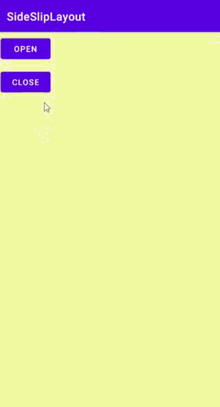
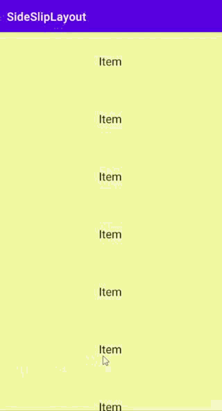

# SideSlipLayout

[](https://jitpack.io/#viifo/SideSlipLayout) [](https://search.maven.org/artifact/io.github.viifo/sidesliplayout)

[中文](https://gitee.com/viifo/SideSlipLayout/blob/master/README.md) | [English](https://gitee.com/viifo/SideSlipLayout/blob/master/README_en.md)

一个整体滑动的侧滑菜单。


## 预览

      


## 依赖

1.  在根目录下的 build.gradle 文件中的 repositories 下添加：

```groovy
allprojects {
    repositories {
        ...
        maven { url 'https://jitpack.io' }
    }
}
```

2.  添加依赖

```groovy
dependencies {
    implementation 'com.github.viifo:SideSlipLayout:1.0.1'
}
```


## 使用

1.  在 XML 中添加：

```xml
<com.viffo.sidesliplayout.SideSlipLayout
    android:id="@+id/side_slip_layout"
    android:layout_width="match_parent"
    android:layout_height="match_parent"
    android:fitsSystemWindows="true">

    <!-- 内容 -->
    <LinearLayout
        android:layout_width="match_parent"
        android:layout_height="match_parent"
        android:orientation="vertical"
        android:background="#F8F8A4">   
    </LinearLayout>

    <!-- 左侧侧边栏 -->
    <LinearLayout
        android:layout_width="200dp"
        android:layout_height="match_parent"
        android:layout_gravity="start"
        android:background="#F35D5D">
    </LinearLayout>

</com.viffo.sidesliplayout.SideSlipLayout>
```

2.  添加侧边栏状态回调：

```java
sideSlipLayout.setStatusCallBack(new SideSlipLayoutCallback() {
    @Override
    public void opened(@NotNull SideSlipLayout layout) {
        // 侧边栏已展开
    }

    @Override
    public void closed(@NotNull SideSlipLayout layout) {
        // 侧边栏已收起
    }

    @Override
    public void dragging(@NotNull SideSlipLayout layout, int left) {
        // 侧边栏正在被拖拽
    }
 });
```

3.  展开侧边栏

```java
if (!sideSlipLayout.isOpening()) {
    sideSlipLayout.open();
}
```

4.  收起侧边栏

```java
if (sideSlipLayout.isOpening()) {
    sideSlipLayout.close();
}
```


## 提示

如果与子 View 出现滑动冲突，需要子 View 根据业务逻辑控制 SideSlipLayout 是否拦截Touch事件。

```
getParent().requestDisallowInterceptTouchEvent(Boolean)
// or 
SideSlipLayout.requestDisallowInterceptTouch(Boolean)
```


## License

```
Copyright 2021 viifo

Licensed under the Apache License, Version 2.0 (the "License");
you may not use this file except in compliance with the License.
You may obtain a copy of the License at

   http://www.apache.org/licenses/LICENSE-2.0

Unless required by applicable law or agreed to in writing, software
distributed under the License is distributed on an "AS IS" BASIS,
WITHOUT WARRANTIES OR CONDITIONS OF ANY KIND, either express or implied.
See the License for the specific language governing permissions and
limitations under the License.
```

