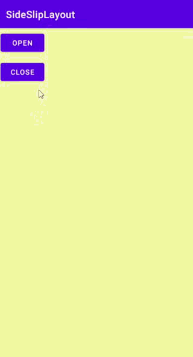
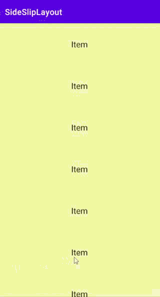

# SideSlipLayout

[](https://jitpack.io/#viifo/SideSlipLayout)

[中文](https://github.com/viifo/SideSlipLayout/blob/master/README.md) | [English](https://github.com/viifo/SideSlipLayout/blob/master/README_en.md)

An overall sliding side-slip layout.


## Preview

      


## Gradle

1.  Add it in your root build.gradle at the end of repositories：

```groovy
allprojects {
    repositories {
        ...
        maven { url 'https://jitpack.io' }
    }
}
```

2.  Add the dependency:

```groovy
dependencies {
    implementation 'com.github.viifo:SideSlipLayout:1.0.1'
}
```


## Usage

1.  Add in XML:

```xml
<com.viffo.sidesliplayout.SideSlipLayout
    android:id="@+id/side_slip_layout"
    android:layout_width="match_parent"
    android:layout_height="match_parent"
    android:fitsSystemWindows="true">

    <!-- content -->
    <LinearLayout
        android:layout_width="match_parent"
        android:layout_height="match_parent"
        android:orientation="vertical"
        android:background="#F8F8A4">   
    </LinearLayout>

    <!-- sidebar -->
    <LinearLayout
        android:layout_width="200dp"
        android:layout_height="match_parent"
        android:layout_gravity="start"
        android:background="#F35D5D">
    </LinearLayout>

</com.viffo.sidesliplayout.SideSlipLayout>
```

2.  Add status callback:

```java
sideSlipLayout.setStatusCallBack(new SideSlipLayoutCallback() {
    @Override
    public void opened(@NotNull SideSlipLayout layout) {
        // opened
    }

    @Override
    public void closed(@NotNull SideSlipLayout layout) {
        // closed
    }

    @Override
    public void dragging(@NotNull SideSlipLayout layout, int left) {
        // dragging
    }
 });
```

3.  Expand the sidebar

```java
if (!sideSlipLayout.isOpening()) {
    sideSlipLayout.open();
}
```

4.  Collapse the sidebar

```java
if (sideSlipLayout.isOpening()) {
    sideSlipLayout.close();
}
```


## Tips

If there is a sliding conflict with the child view, the child view needs to control whether the SideSlipLayout intercepts the Touch event according to the business logic.

```
getParent().requestDisallowInterceptTouchEvent(Boolean)
// or 
SideSlipLayout.requestDisallowInterceptTouch(Boolean)
```


## License

```
Copyright 2021 viifo

Licensed under the Apache License, Version 2.0 (the "License");
you may not use this file except in compliance with the License.
You may obtain a copy of the License at

   http://www.apache.org/licenses/LICENSE-2.0

Unless required by applicable law or agreed to in writing, software
distributed under the License is distributed on an "AS IS" BASIS,
WITHOUT WARRANTIES OR CONDITIONS OF ANY KIND, either express or implied.
See the License for the specific language governing permissions and
limitations under the License.
```

